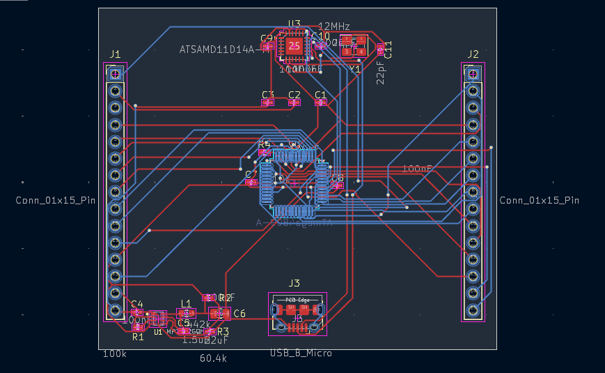

# Arduino Nano Every - Chip-Level PCB Replica

A full chip-level PCB replica of the Arduino Nano Every (ABX00028), designed from scratch in KiCad 10 - complete schematic, custom component creation, auto+manual routing, and manufacturing-ready output.

## Overview
This project replicates the official Arduino Nano Every board at the component level, rebuilding its schematic and PCB layout across five sub-circuits, verifying the design with zero DRC (Design Rule Check) errors, and generating full manufacturing files (Gerbers, drill files, BOM).

## Sub-Circuits Designed
1. MP2322 Power Regulator - voltage regulation circuit
2. ATmega4809 MCU - main microcontroller circuit
3. ATSAMD11D14A USB Bridge - USB-to-serial bridge controller
4. USB Micro-B Connector - power/data input
5. I/O Headers - 2x 15-pin connectors for digital/analog I/O

## PCB Layout

## 3D Renders
Top and Bottom renders available in images/pcb_3d_top.png and images/pcb_3d_bottom.png

## Schematic
Full schematic available as PDF: images/schematic_overview.pdf

## Design Process
- Schematic captured across 5 sub-circuits in KiCad 10
- Custom footprint and 3D model created for the MP2322 regulator (not available in standard libraries) - see components/ folder
- PCB layout with auto-routing via FreeRouting v2.2.4, followed by manual trace completion for optimization
- Design Rule Check (DRC) run to zero errors before finalizing
- Full manufacturing output generated: Gerbers, drill files (PTH/NPTH), and Bill of Materials

## Repository Structure
kicad_project/
|-- NanoEvery_Replica.kicad_pro     - KiCad project file
|-- NanoEvery_Replica.kicad_sch     - Schematic
|-- NanoEvery_Replica.kicad_pcb     - PCB layout
|-- gerber_files/                    - Manufacturing-ready Gerber + drill files
|-- bom/                              - Bill of Materials (CSV)
|-- components/                       - Custom footprint, symbol, and 3D model (MP2322)
|-- images/                           - Schematic, PCB layout, and 3D render exports

## Bill of Materials
Full BOM available in bom/NanoEvery_Replica.csv

## Manufacturing Files
Gerber and drill files ready for fabrication are in gerber_files/

## What I Learned
- Full-board schematic design across multiple interconnected sub-circuits
- Creating custom footprints and 3D models for components not in standard libraries
- PCB auto-routing (FreeRouting) combined with manual routing optimization
- Design Rule Checking and achieving a fully clean (zero-error) layout
- Generating complete, fabrication-ready manufacturing outputs (Gerbers, drill files, BOM)

## Future Improvements
- Order and assemble a physical prototype to validate the design
- Add functional testing documentation once built